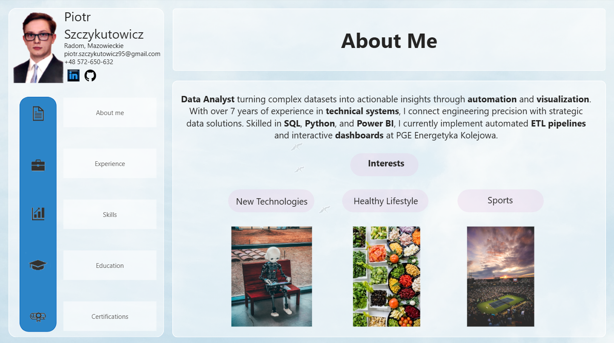

# Interactive CV in Power BI

Interactive CV built in Power BI - showcasing how a traditional resume can be transformed into a dynamic, data-driven product.

---

## About

Data Analyst with 7+ years in technical systems, building automated data solutions and interactive dashboards (Power BI, SQL, Python). Currently working at PGE Energetyka Kolejowa, focusing on ETL pipelines, data modeling, and reporting.

---

## Features

- Interactive navigation (buttons, bookmarks)
- Dynamic content based on user selection
- Drill-down across career history
- Skills presented as an interactive selector

---

## Experience

- BI & Data Analyst - PGE Energetyka Kolejowa (2025-now) - Power BI dashboards, ETL pipelines (Python, SQL), SAP integration, regulatory reporting
- Assistant Signaling Designer (2017-2024) - Railway traffic control systems design

---

## Tech Stack

Power BI, SQL, Python, Excel, Power Automate, SAP, Microsoft Fabric

---

## Why This Project?

To demonstrate how Power BI can be used beyond traditional dashboards - as a fully interactive personal portfolio combining UX, data modeling, and storytelling. Focused on combining data modeling with user experience and clear information flow.

---

## How to Open

Download the `.pbix` file and open it in [Power BI Desktop](https://powerbi.microsoft.com/desktop/) (free).

---

## Author

Piotr Szczykutowicz

[LinkedIn](https://www.linkedin.com/in/piotr-szczykutowicz-51b493214/)
